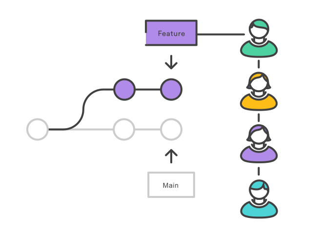
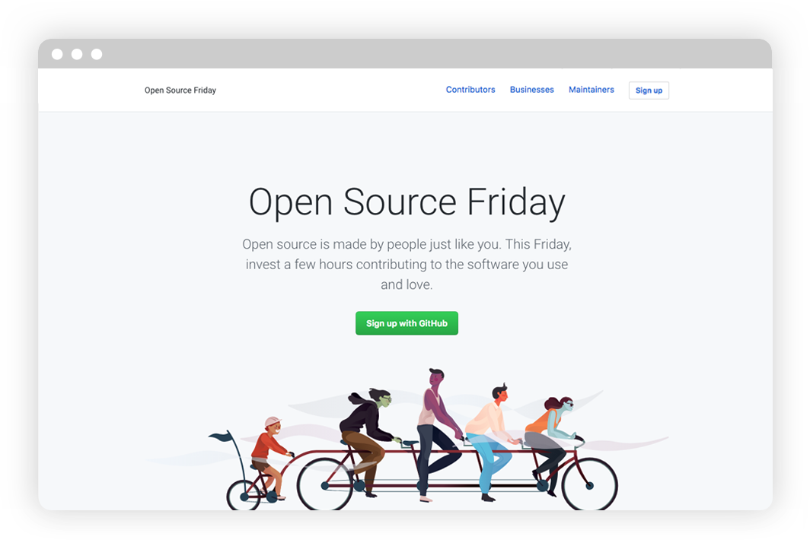

<br>
# Branching Out
Exploring the Wonders of Git <!-- fit -->

---

<style scoped>
h1 {
  color: black;
  font-size: 100px;
}
</style>

<!-- _class: lead -->
# git history


<!--
Linus Torvalds - 2005 - when creating Linux
Current tooling was insufficient
-->

---

<style scoped>
h1 {
  color: black;
  font-size: 100px;
}
</style>

<!-- _class: lead -->
# why git?

---

# Distributed


<!--
own local copy
faster
don't get blocked
multiple copies is safer
-->

---

# Branching


<!-- 
work isolated
can map your way of work, e.g. story to branch

-->

---

# Merging (via Pull Requests)



<!--
prevent destruction
facilitate communication
-->

---

# Community



<!--
Git underpins most open source projects
It allows working everywhere
-->

---

# Some tools

- The terminal ⌨️
- PyCharm / IntelliJ
- VS Code with extensions
  - Git Graph
  - Git Blame
- lazygit
- SourceTree
- Find what works for you ✨

---

<style scoped>
h1 {
  color: black;
  font-size: 100px;
}
</style>

<!-- _class: lead -->
# let's use it

---


---


---

# Good practices

- continuous integration
- branch naming
- pull before push 
- `pre-commit`
- no secrets 🤫


---

# Good practices - PRs

- test before creation
- smaller is nicer 😊
- positive feedback 👍
- not approving one's own 😬


---

<col1>

```sh
git remote add origin git@github.com:pugillum/blabla.git
git branch -M main
git push -u origin main
```